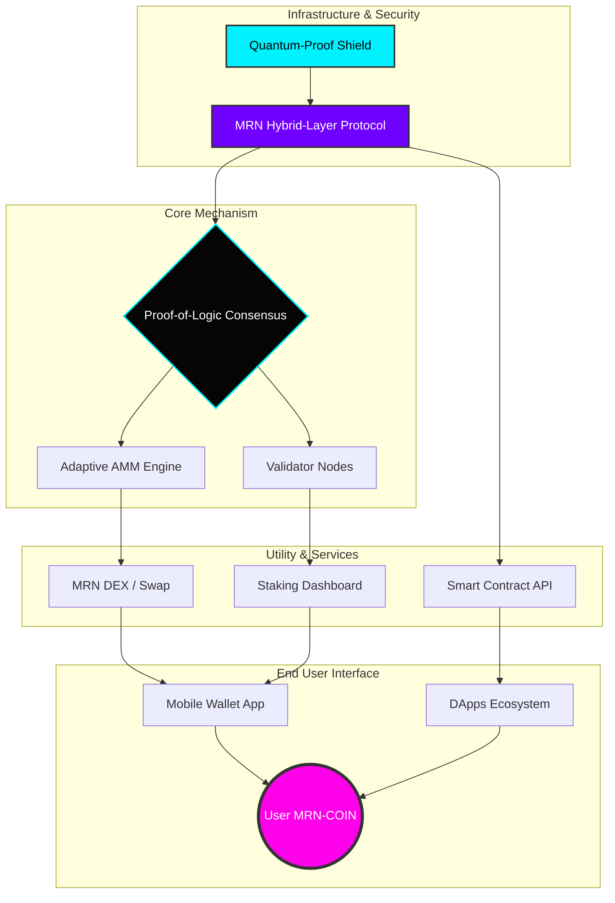

# 👑 MajawangiRoyalNusantara COIN (MRN)

  

 

---

## 🌏 Bridging Heritage with Blockchain

**MajawangiRoyalNusantara COIN (MRN)** adalah aset digital berbasis jaringan Ethereum yang mengintegrasikan nilai ekonomi tradisional Nusantara dengan efisiensi teknologi blockchain global.

MRN dirancang sebagai token representatif ekosistem budaya, komoditas unggulan, dan ekonomi kreatif Indonesia.

---

# 🧠 MRN Architecture Overview

---

# 🎯 Visi & Misi

## 🌟 Visi
Menjadi aset digital representatif Nusantara yang mengintegrasikan nilai ekonomi tradisional dengan efisiensi teknologi blockchain global.

## 🚀 Misi

### 1️⃣ Digitalisasi Aset
Memberikan akses bagi pemegang MRN ke ekosistem aset riil yang terkurasi di Indonesia.

### 2️⃣ Pemberdayaan Ekonomi Lokal
Menjadi instrumen pendanaan bagi proyek produktif di sektor:
- Pariwisata budaya  
- Warisan kerajaan  
- UMKM premium  
- Industri kreatif Nusantara  

### 3️⃣ Transparansi & Keamanan
Menjamin ekosistem transaksi yang aman melalui Smart Contract yang teraudit dan transparan di blockchain Ethereum.

---

# 🏛 Strategi Aset Riil (Real World Assets - RWA)

Agar MRN memiliki value jangka panjang dan fundamental kuat, token ini didukung oleh unit bisnis nyata.

## 🔱 Tiga Pilar Ekosistem MRN

| Pilar Ekosistem | Penjelasan Profesional |
|-----------------|------------------------|
| 👑 **Royal Heritage Tourism** | MRN digunakan sebagai instrumen akses eksklusif (membership) atau alat pembayaran di destinasi wisata berbasis budaya/keraton. |
| ☕ **Commodity Backed** | Keuntungan komoditas unggulan (Rempah, Kopi, Logam Mulia) dialokasikan untuk Buyback & Burn. |
| 🛍 **Digital Marketplace** | Platform e-commerce premium berbasis MRN untuk produk seni dan kerajinan Nusantara. |

---

# 📈 Mekanisme Nilai (Tokenomics Sustainability)

## 🔥 Deflationary Value Model

### 1️⃣ Revenue Sharing
Keuntungan ekosistem dikonversi menjadi MRN melalui pembelian di pasar terbuka.

### 2️⃣ Burn Mechanism
Pengurangan supply melalui fungsi burn berkala di smart contract.

### 3️⃣ Staking Rewards
Pemegang MRN dapat mengunci token untuk memperoleh dividen digital.

---

# 🛡 Keamanan & Transparansi

- ERC20 Standard  
- Ethereum Network  
- Burn Function  
- Staking Compatible  
- Audit Ready  

---

# 🤝 Contributing

Kami terbuka terhadap kontribusi komunitas untuk mengembangkan MRN menjadi proyek yang kuat dan berkelanjutan.

**Cara berkontribusi:**
- Ajukan *Pull Request*
- Buka *Issue*
- Diskusikan ide pengembangan ekosistem

---

Jika project ini bermanfaat, jangan lupa beri ⭐ di repository!

## 🤝 Kontribusi

Kami sangat terbuka terhadap kontribusi dari siapa pun yang ingin mengembangkan **KongaliCoin** menjadi proyek yang lebih kuat, aman, dan bermanfaat bagi banyak orang.

💡 **Cara berkontribusi:**
- Ajukan *Pull Request* untuk penambahan fitur atau perbaikan kode.
- Buka *Issue* jika menemukan bug, error, atau ide baru.
- Diskusikan fitur inovatif yang dapat meningkatkan ekosistem KongaliCoin.

Setiap kontribusi, sekecil apa pun, sangat berarti bagi komunitas ini.  
Mari bersama membangun ekosistem digital yang lebih baik! 🚀

## ❤️ Dibuat Dengan Semangat

Karya ini dibuat dengan penuh dedikasi oleh:

### **👤 Kong Ali — (@kongali1720)**  

Founder & Developer of **KongaliCoin**  
Building the future of digital finance with clarity, transparency, and innovation. 

Jika kamu menyukai proyek ini, jangan lupa beri ⭐ di repository untuk mendukung perkembangan selanjutnya!

---

## ✅ Gaspol Coding Squad Indonesia! 🚀💻
 Belajar sambil praktek langsung. 
 Run it, understand it. 
 Mini project Python yang gak bikin ngantuk!  

---

## ☕ Buy me coffee  

<strong>Dukung terus biar semangat bikin karya edukatif lainnya...</strong> 
💡 ☕ <a href="https://www.paypal.com/paypalme/bungtempong99" target="_blank">Buy Me a Coffee via PayPal</a>

---

## ❤️ INITIATING HUMANITY MODE... for Down Syndrome

<table align="center">
  <tr><th>Target</th><td>Anak-anak Pejuang Down Syndrome</td></tr>
  <tr><th>Status</th><td>Butuh Dukungan</td></tr>
  <tr><th>Aksi</th><td>Buka Hati + Klik Link = Senyum Baru</td></tr>
</table>

<em>Mereka bukan berbeda. Mereka hadir untuk mengajarkan kita arti cinta sejati dan kesabaran.</em>

---

## 💳 Dukungan Pembayaran DONASI

  
  &nbsp;&nbsp;
  
  &nbsp;&nbsp;
  

---

Kalau project ini bermanfaat, kasih ⭐ ya dan share ke temen-temenmu! 
Follow <a href="https://twitter.com/kongali1720" target="_blank">@kongali1720</a> buat update seru lainnya 🔥  

